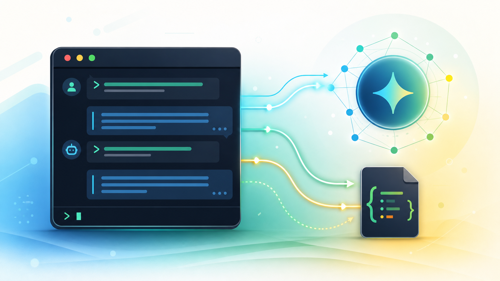

# Gemini Chat API CLI



A simple Python terminal chatbot powered by the Gemini API. This project started as a basic one-shot API call and has grown into a small chat application with model fallback, conversation history, and persistent memory.

## What This Project Does

- Loads a Gemini API key from a local `.env` file
- Starts an interactive chat in the terminal
- Sends your conversation history to Gemini on every request
- Keeps memory during the chat session
- Saves memory to `chat_history.json` so it can remember across restarts
- Supports `/clear` to reset memory
- Supports `exit`, `quit`, or `q` to stop the chat
- Falls back to another Gemini model if the first model fails

## Why This Is Interesting

This is a first step toward building an agentic AI application.

Instead of only asking a model one question, the app now manages:

- **State**: previous messages are stored as conversation history
- **Memory**: chat history is saved locally and loaded again later
- **Model access**: the app connects to Gemini through the official SDK
- **Error handling**: failed model calls are handled cleanly
- **Fallback behavior**: the app can try multiple models automatically

These are small but important building blocks for future AI agents.

## Project Files

```text
gemini-chat-api/
+-- app.py              # Main chatbot application
+-- .env                # Stores your Gemini API key
+-- .gitignore          # Prevents private/local files from being committed
+-- requirements.txt    # Python dependencies
+-- chat_history.json   # Saved chat memory, created after chatting
+-- README.md           # Project explanation
```

## How Messages Are Sent To Gemini

When you type a message, the app adds it to a Python list called `history`.

Example:

```python
{
    "role": "user",
    "parts": [{"text": "My name is Rushi"}]
}
```

Then the full conversation history is sent to Gemini:

```python
response = client.models.generate_content(
    model=model,
    contents=history,
)
```

This is important because Gemini does not automatically remember previous messages. The app gives it memory by sending the previous conversation again with each new request.

## Memory Flow

```text
You type a message
        |
Message is added to history
        |
Full history is sent to Gemini
        |
Gemini returns a reply
        |
Reply is added to history
        |
History is saved to chat_history.json
```

## Setup

Install dependencies:

```powershell
.\.venv\Scripts\python.exe -m pip install -r "gemini-chat-api\requirements.txt"
```

Create a `.env` file:

```env
GEMINI_API_KEY=your_api_key_here
```

Optionally choose a model:

```env
GEMINI_MODEL=gemini-3.1-flash-lite
```

## Run The Chatbot

From the project root:

```powershell
.\.venv\Scripts\python.exe "gemini-chat-api\app.py"
```

Then chat normally:

```text
You: My name is Rushi
Gemini: Nice to meet you, Rushi.

You: What is my name?
Gemini: Your name is Rushi.
```

Stop the app:

```text
exit
```

Clear memory:

```text
/clear
```

## Key Concepts Learned

- Calling an AI model through an API
- Loading secrets safely with `.env`
- Structuring chat messages with `role` and `parts`
- Maintaining conversation history
- Saving and loading JSON memory
- Handling API failures gracefully
- Designing a CLI app that feels like a real chatbot

## Next Ideas

- Add a system prompt
- Add tools like calculator, file reader, or web search
- Store important memories separately from full chat history
- Build a RAG bot that answers from your own notes
- Turn this into a simple web app with Streamlit or Flask
- Add an agent planner that breaks goals into steps
